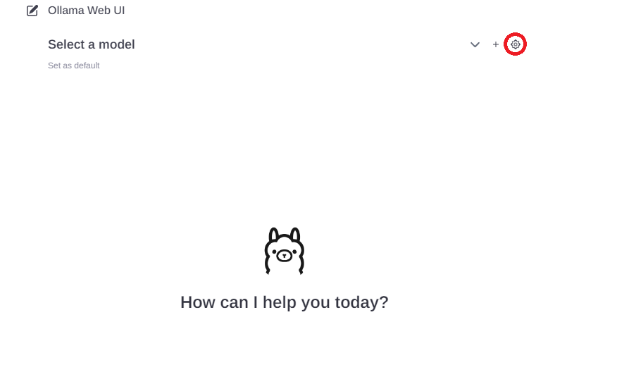
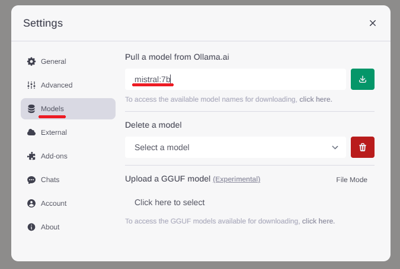

# Ollama CI/CD pipeline

Deploy Ollama server with CI/CD on Elestio

 
 

# Once deployed ...

You can open Ollama UI here:

    URL: https://[CI_CD_DOMAIN]
    login: [ADMIN_EMAIL]
    password: [ADMIN_PASSWORD]

You can open Ollama API here:

    URL: https://[CI_CD_DOMAIN]:57987
    login: "root"
    password: [ADMIN_PASSWORD]

You can open pgAdmin here:

    URL: https://[CI_CD_DOMAIN]:33374
    login: [ADMIN_EMAIL]
    password: [ADMIN_PASSWORD]

# Ollama UI Documentation

This guide will walk you through the steps of making a new request and pulling a model

## Making a New Request

### Choose a Model:

To initiate a new request, click on the chevron down at the top of the screen. This will open a menu where you can select from the available models. If you have previously pulled a model, it will be displayed here for quick access.

## Pulling a Model

To pull a model using the UI, follow these steps:

- Click on the Cork Icon:
  Navigate to the top of the screen and click on the cork icon, as shown in the image below:

  

- Access Models Section:
  A popup will appear. Within the popup, navigate to the Models section.

- Type Model Name:
  In the Models section, type the name of the model you wish to pull. For example, you can type mistral:7b.

    

- Follow these simple steps, and you'll successfully pull a model to enhance your natural language generation experience with Ollama.

# Ollama API Documentation

Welcome to the Ollama API documentation. This guide provides comprehensive information on how to interact with the Ollama API using the curl command.

## Pulling a Model

To pull a model from the Ollama API, utilize the following curl command:

    curl -u root:[ADMIN_PASSWORD] https://[CI_CD_DOMAIN]:57987/api/pull -d '{
        "name": "<YOUR_MODEL>"
    }'

Replace `<YOUR_MODEL>` with the desired model name.

## Request Ollama API with Stream and without Stream

The Ollama API offers two methods for generating responses based on your preferences: with stream and without stream. Below are examples using the curl command to illustrate both scenarios.

### Request with Stream

To utilize the stream feature and receive the response on one line per word, use the following curl command:

    curl -u root:[ADMIN_PASSWORD] https://[CI_CD_DOMAIN]:57987/api/generate -d '{
        "model": "<YOUR_MODEL>",
        "prompt": "Why is the sky blue?"
    }'

In this mode, the response will be formatted in a continuous stream, with each word presented on a single line, providing a fluid and easily readable output.

### Request without Stream

If you prefer a more traditional response format, where the result is not streamed and is presented as a structured output, use the following curl command:

    curl -u root:[ADMIN_PASSWORD] https://[CI_CD_DOMAIN]:57987/api/generate -d '{
        "model": "<YOUR_MODEL>",
        "prompt": "Why is the sky blue?",
        "stream": false
    }'

In this mode, the response will be structured, presenting the generated content in a conventional manner. This option is useful when you prefer a clear and organized output for easier parsing and understanding.

## Documentation

For more detailed information about the Ollama API and its features, please refer to the official API documentation available <a target="_blank" href="https://github.com/jmorganca/ollama/blob/main/docs/api.md">here</a>.
